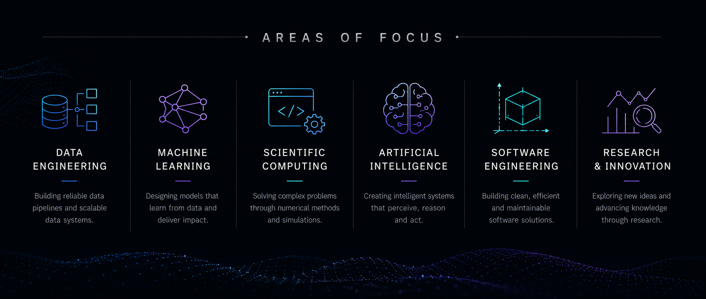
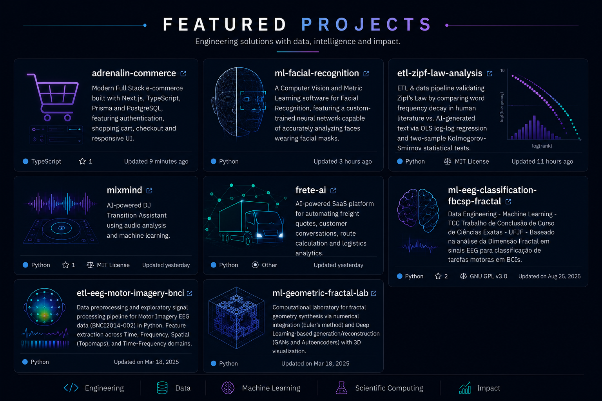
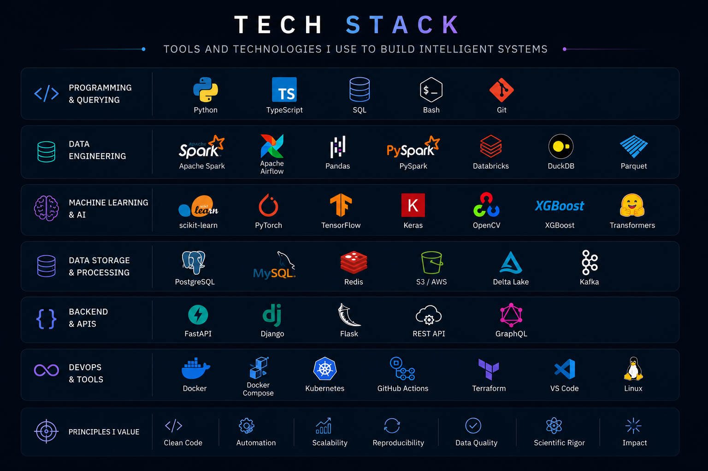
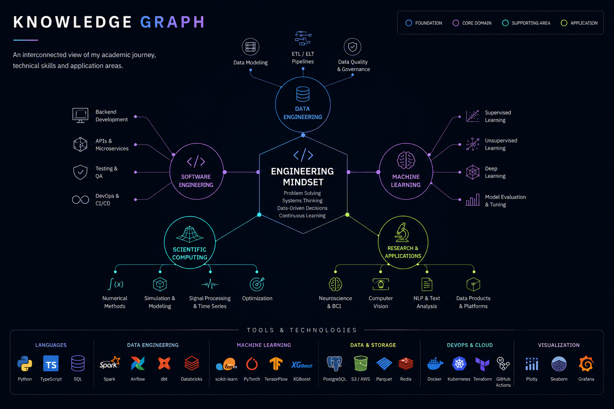
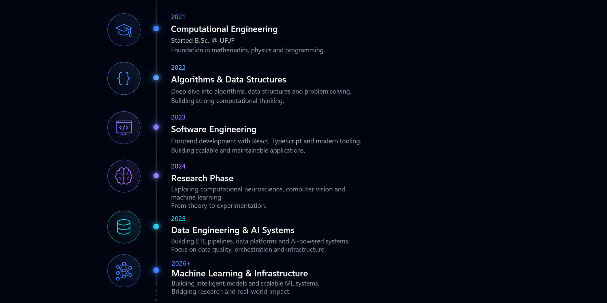

  <picture>
    <source media="(prefers-color-scheme: dark)" srcset="assets/banner.png">
    
  </picture>

  <a href="https://github.com/Daniel-Thielmann?tab=repositories"><code>./repositories</code></a>
  &nbsp;&middot;&nbsp;
  <a href="https://linkedin.com/in/daniel-thielmann"><code>./linkedin</code></a>
  &nbsp;&middot;&nbsp;
  <a href="http://wa.me/5532991468218"><code>./contact</code></a>

---

  <picture>
    <source media="(prefers-color-scheme: dark)" srcset="assets/section-headers.png">
    
  </picture>

## About

Engineer in training — building at the intersection of data, machine learning and scientific computing.

My work spans end-to-end ETL pipelines, statistical models, AI-powered platforms and numerical simulation. I approach every problem with the rigor of research and the pragmatism of engineering.

Previous experience in computational neuroscience, computer vision and full-stack development. Current focus: data engineering, ML systems and scientific computing infrastructure.

---

## Featured Projects

  <picture>
    <source media="(prefers-color-scheme: dark)" srcset="assets/project-cards.png">
    
  </picture>

---

> **mixmind** — AI-powered DJ transition assistant using audio analysis and machine learning.
>
> **frete ai** — Intelligent freight quotation platform with AI-driven logistics automation.
>
> **eeg motor imagery classification** — BCI classification using FBCSP and fractal dimension analysis.
>
> **facial recognition** — CNN trained via metric learning for face verification, including masked faces.
>
> **hodgkin–huxley simulator** — Numerical simulation of action potential dynamics in neurons.
>
> **zipf law analysis** — ETL pipeline validating Zipf's Law via OLS regression and KS statistical tests.

---

## Research

| Area                            | Topics                                                                                       |
| ------------------------------- | -------------------------------------------------------------------------------------------- |
| **Computational Neuroscience**  | EEG signal processing, BCI classification (FBCSP, fractal analysis), Hodgkin–Huxley modeling |
| **Computer Vision**             | Facial recognition via metric learning, deep feature embeddings                              |
| **Natural Language Processing** | Statistical text analysis, frequency distribution modeling, corpora comparison               |
| **Geometric Modeling**          | Fractal geometry synthesis, GAN-based generation, numerical integration                      |

---

## Technical Stack

  <picture>
    <source media="(prefers-color-scheme: dark)" srcset="assets/tech-stack.png">
    
  </picture>

---

## Knowledge Graph

  <picture>
    <source media="(prefers-color-scheme: dark)" srcset="assets/knowledge-graph.png">
    
  </picture>

---

## Evolution

  <picture>
    <source media="(prefers-color-scheme: dark)" srcset="assets/timeline.png">
    
  </picture>

---

  <code>thielmanndan@gmail.com</code>
  &nbsp;&middot;&nbsp;
  <a href="https://linkedin.com/in/daniel-thielmann"><code>linkedin.com/in/daniel-thielmann</code></a>
  &nbsp;&middot;&nbsp;
  <code>Juiz de Fora, MG · Brasil</code>

